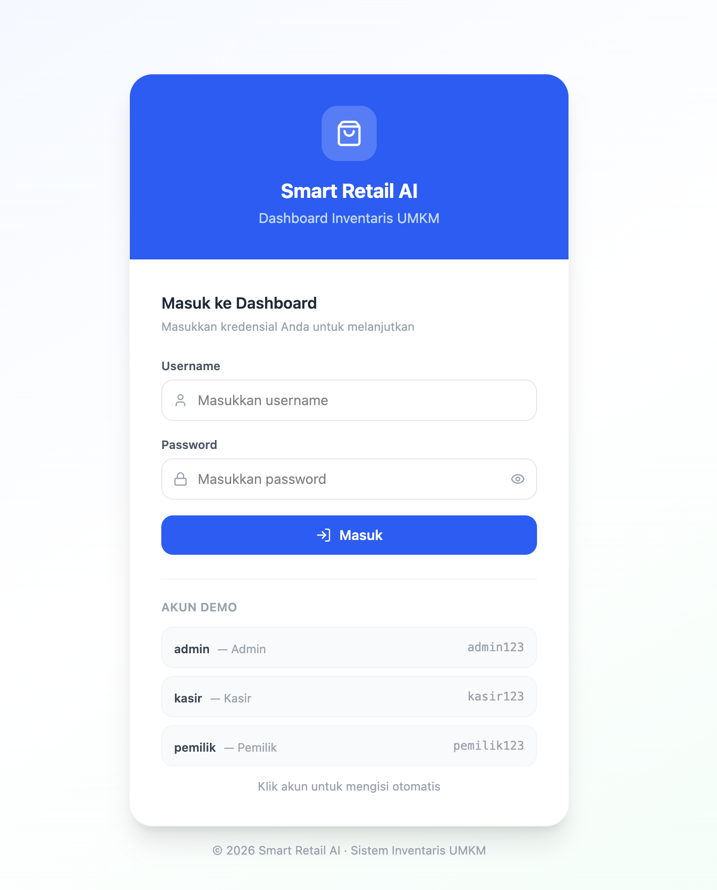
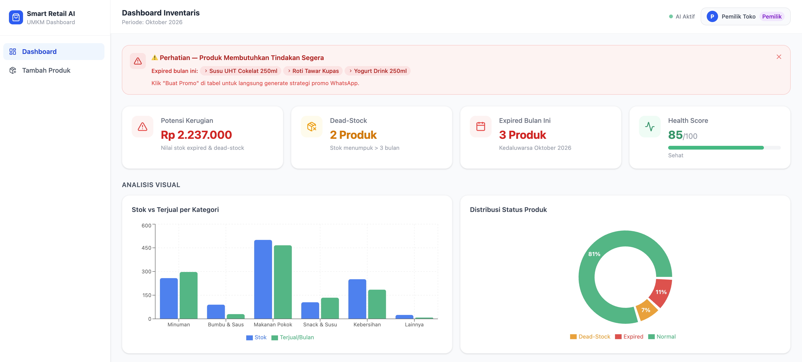
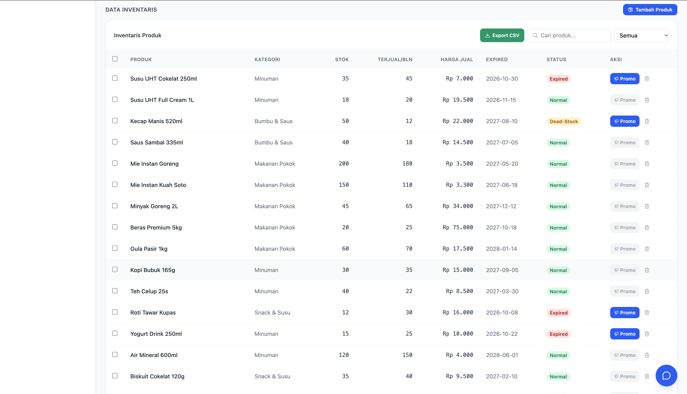
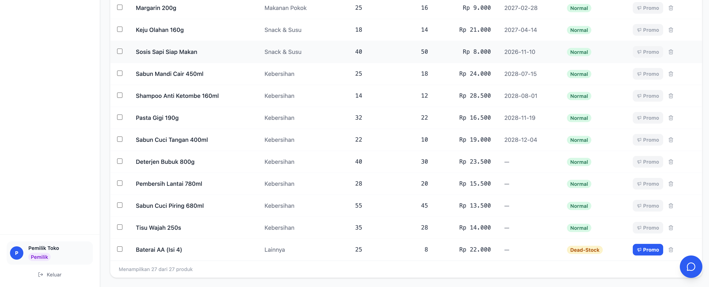
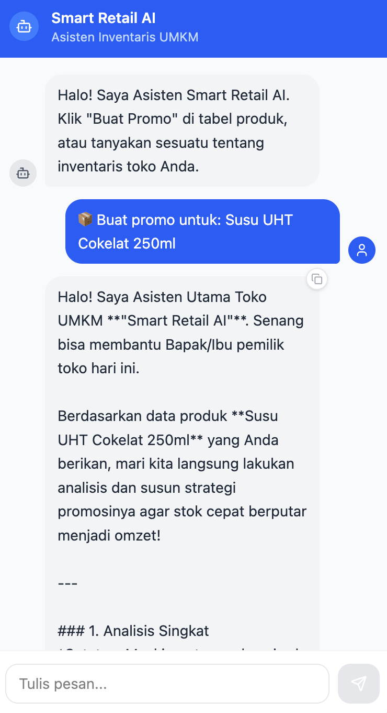

<div align="center">

# 🛒 Smart Retail AI — UMKM Inventory Dashboard

**Hackathon Project — IBM Bob × LangFlow**

Dashboard inventaris cerdas untuk UMKM dengan asisten AI yang bisa membuat teks promosi WhatsApp secara otomatis.

[](https://smart-retail-ai-ten.vercel.app/)


</div>

---

## 📋 Deskripsi Proyek

**Smart Retail AI** adalah dashboard manajemen inventaris untuk pemilik UMKM yang dilengkapi asisten AI berbasis LangFlow. Asisten dapat menganalisis kondisi stok dan secara otomatis menghasilkan teks promosi WhatsApp yang siap kirim — membantu pemilik toko mengurangi kerugian akibat produk expired atau dead-stock.

### 🎯 Masalah yang Dipecahkan

| Masalah UMKM | Solusi Smart Retail AI |
|---|---|
| Stok expired tidak terpantau | Alert banner + badge status realtime |
| Dead-stock menumpuk di gudang | Deteksi otomatis + rekomendasi promo |
| Buat teks promo WhatsApp lama | Klik "Buat Promo" → AI hasilkan teks dalam detik |
| Tidak ada analisis visual stok | Bar chart + donut chart per kategori |
| Susah menghitung potensi kerugian | KPI cards otomatis hitung nilai risiko |

---

## 🏗️ Arsitektur Sistem

```
┌─────────────────────────────────────────────────────┐
│                   Browser / Panitia                  │
│         https://smartretailai-umkm.loca.lt           │
└──────────────────────┬──────────────────────────────┘
                       │ HTTPS (via localtunnel)
┌──────────────────────▼──────────────────────────────┐
│              Mac Developer (Host)                    │
│                                                      │
│  ┌─────────────────────────────────────────────┐    │
│  │       Vite Dev Server  :5173                │    │
│  │       React + Tailwind + Recharts           │    │
│  │                                             │    │
│  │  /langflow-api  ──proxy──►  :7860           │    │
│  └────────────────────────┬────────────────────┘    │
│                           │                          │
│  ┌────────────────────────▼────────────────────┐    │
│  │     LangFlow Desktop  :7860                 │    │
│  │     Flow: UMKM Smart Retail Promo Generator │    │
│  │     Model: gemini-3.5-flash-lite            │    │
│  └────────────────────────┬────────────────────┘    │
└──────────────────────────┬──────────────────────────┘
                           │ Google Gemini API
                    ┌──────▼──────┐
                    │  Gemini AI  │
                    └─────────────┘
```

---

## 🤖 Peran IBM Bob dalam Pengembangan

> **IBM Bob** adalah AI coding assistant yang digunakan sebagai **development environment utama** sepanjang proyek ini.

### Apa yang dilakukan IBM Bob:

| Tugas | Detail |
|---|---|
| **Scaffolding & Arsitektur** | Bob merancang struktur folder, komponen React, dan alur data dari awal |
| **Debugging LangFlow** | Bob mendiagnosis error model deprecated (`gemini-2.5-flash-lite → 404`) dan memperbaikinya via LangFlow REST API tanpa perlu buka UI |
| **Konfigurasi MCP** | Bob mengonfigurasi MCP server (`supergateway → LangFlow`) di `.bob/mcp.json` dan memperbaiki Project ID yang salah |
| **Fix CORS & Proxy** | Bob mengonfigurasi Vite proxy `/langflow-api` agar frontend bisa memanggil LangFlow tanpa CORS error |
| **Tunnel Online** | Bob menginstall dan mengonfigurasi `localtunnel` + `allowedHosts: true` agar dashboard bisa diakses panitia dari internet |
| **Security** | Bob memindahkan API keys dari hardcode ke `.env` agar aman saat di-push ke GitHub |
| **Code Quality** | Bob menulis semua komponen React dengan clean code, custom hooks, dan proper error handling |

### MCP Integration (Bob ↔ LangFlow)

Bob terhubung langsung ke LangFlow melalui **MCP (Model Context Protocol)** — memungkinkan Bob memanggil flow LangFlow sebagai tool:

```
IBM Bob  ──MCP──►  supergateway  ──►  LangFlow :7860
                   (npm package)       /api/v1/mcp/project/.../streamable
```

Tools yang tersedia via MCP:
- `new_flow_1` — flow general purpose
- `umkm_smart_retail_promo_genera` — flow khusus promo UMKM

---

## 🔄 Peran LangFlow dalam Proyek

> **LangFlow Desktop** adalah visual AI workflow builder yang digunakan sebagai **backend AI engine** untuk chatbot.

### Flow yang Digunakan

**Flow: `UMKM Smart Retail Promo Generator 2`**
- **ID:** `ecbe443a-cafc-4991-a25e-1fdee7d85b75`
- **Model:** `gemini-3.5-flash-lite` (Google Generative AI)
- **Fungsi:** Menerima data produk (nama, stok, status, expired) → menghasilkan analisis + teks promo WhatsApp

### Cara LangFlow Dipanggil

```javascript
// Frontend memanggil LangFlow via Vite proxy
POST /langflow-api/api/v1/run/{flow_id}
Headers: { "x-api-key": "..." }
Body: {
  "input_value": "Produk Susu UHT 35 unit, expired 2026-10-30...",
  "input_type": "chat",
  "output_type": "chat"
}
```

### Dual-Mode Fallback

```
Request AI
    │
    ├─► LangFlow (utama) ──► OK → tampil di chat
    │        │
    │        └─► Gagal (timeout/error model)
    │                │
    └────────────────►─► Gemini Direct API (fallback)
                              gemini-3.5-flash-lite
                              gemini-3.5-flash
                              gemini-2.0-flash
                              gemini-1.5-flash
```

---

## ✨ Fitur Dashboard

### 📊 KPI Cards (4 Metrik Utama)
- **Potensi Kerugian** — Total nilai Rp produk berisiko
- **Dead-Stock** — Produk dengan stok > 3 bulan supply
- **Expired Bulan Ini** — Produk kedaluwarsa di bulan berjalan  
- **Health Score** — Skor 0–100 kesehatan inventaris

### 📈 Visualisasi Chart
- **Bar Chart** — Perbandingan stok vs terjual per kategori
- **Donut Chart** — Distribusi status produk (Normal / Dead-Stock / Expired)

### 📋 Tabel Inventaris Interaktif
- Search produk by nama
- Filter by kategori
- Badge status berwarna (Normal / Dead-Stock / Hampir Expired / Expired)
- Export CSV
- Multi-select + bulk delete
- Tombol **"Buat Promo"** per produk

### 🤖 Chat AI Widget
- Floating chat di pojok kanan bawah
- Klik "Buat Promo" di tabel → prompt otomatis terisi + chat terbuka
- AI menghasilkan: analisis produk + skema promo + teks WhatsApp siap kirim
- Badge sumber: `via: LangFlow` atau `via: Gemini (model-name)`
- Copy button pada setiap respons AI

### 🔐 Autentikasi
| Username | Password | Role |
|---|---|---|
| `admin` | `admin123` | Administrator |
| `kasir` | `kasir123` | Kasir |
| `pemilik` | `pemilik123` | Pemilik Toko |

---

## 🚀 Cara Menjalankan

### Prasyarat
- **Node.js** v18+
- **LangFlow Desktop** terinstall di `/Applications/Langflow .app`
- **Google Gemini API Key** (dari [Google AI Studio](https://aistudio.google.com/app/apikey))

### 0. Coba Langsung (Tanpa Install)

> 🌐 **[https://smart-retail-ai-ten.vercel.app/](https://smart-retail-ai-ten.vercel.app/)**
>
> Login: `admin` / `admin123`

### 1. Clone & Setup

```bash
git clone https://github.com/nandapratama/smart-retail-ai.git
cd smart-retail-ai

# Setup environment variables
cp umkm-dashboard/.env.example umkm-dashboard/.env
# Edit .env → isi VITE_LANGFLOW_API_KEY dan VITE_GEMINI_API_KEY

# Install dependencies
cd umkm-dashboard && npm install
```

### 2. Jalankan (Mode Lokal)

```bash
# Dari root project
bash start.sh
```

Dashboard otomatis terbuka di `http://localhost:5173`

### 3. Jalankan (Mode Online — untuk Demo Jarak Jauh)

```bash
bash start.sh --online
```

Terminal akan menampilkan URL publik:
```
🌐 URL ONLINE (bagikan ke panitia):
   https://smartretailai-umkm.loca.lt
```

Bagikan URL ini ke panitia — mereka bisa akses dari device apapun tanpa install apapun.

### 4. Manual (tanpa start.sh)

```bash
# Terminal 1: Buka LangFlow Desktop
open "/Applications/Langflow .app"

# Terminal 2: Jalankan dashboard
cd umkm-dashboard
npm run dev

# Terminal 3 (opsional, untuk demo online):
cd umkm-dashboard
./node_modules/.bin/lt --port 5173 --subdomain smartretailai-umkm
```

---

## 📁 Struktur Project

```
smart-retail-ai/
│
├── 📄 README.md                    ← Dokumentasi ini
├── 📄 start.sh                     ← Auto-start script (lokal & online)
├── 📄 Start Smart Retail AI.command← Double-click launcher macOS
├── 📄 .gitignore
│
└── 📦 umkm-dashboard/              ← React App
    ├── 📄 .env.example             ← Template environment variables
    ├── 📄 vite.config.js           ← Vite config (proxy, host, allowedHosts)
    ├── 📄 package.json
    │
    └── src/
        ├── 📄 App.jsx              ← Entry point (auth guard → login/dashboard)
        ├── 📄 main.jsx
        ├── 📄 index.css            ← Tailwind CSS import
        │
        ├── pages/
        │   ├── DashboardPage.jsx   ← Layout utama + sidebar + state management
        │   └── LoginPage.jsx       ← Form login dengan demo accounts
        │
        ├── components/
        │   ├── AlertBanner.jsx     ← Banner peringatan produk expired
        │   ├── SummaryCards.jsx    ← 4 KPI cards
        │   ├── StockCharts.jsx     ← Bar chart + donut chart (Recharts)
        │   ├── ActionTable.jsx     ← Tabel inventaris + filter + export CSV
        │   ├── AddProductModal.jsx ← Modal tambah produk baru
        │   └── AgentChatWidget.jsx ← Chat AI (LangFlow + Gemini fallback)
        │
        ├── config/
        │   ├── langflow.js         ← LangFlow & Gemini config (dari .env)
        │   └── auth.js             ← Demo user credentials
        │
        ├── data/
        │   └── inventory.js        ← 27 mock products data
        │
        ├── hooks/
        │   ├── useAuth.js          ← Login/logout/session hook
        │   └── useInventory.js     ← Reactive inventory state (add/delete)
        │
        └── utils/
            └── kpi.js              ← KPI calculation functions
```

---

## 🛠️ Tech Stack

| Kategori | Teknologi |
|---|---|
| **Frontend Framework** | React 18 + Vite 8 |
| **Styling** | Tailwind CSS v4 |
| **Charts** | Recharts |
| **HTTP Client** | Axios |
| **Icons** | Lucide React |
| **AI Backend** | LangFlow Desktop |
| **AI Model** | Google Gemini (via LangFlow) |
| **AI Fallback** | Gemini Direct API |
| **Dev Assistant** | IBM Bob (AI coding assistant) |
| **Tunnel** | localtunnel (demo online) |
| **MCP** | supergateway (Bob ↔ LangFlow) |

---

## 🔧 Environment Variables

Salin `.env.example` → `.env` dan isi nilainya:

```env
# Mode AI: 'gemini-only' (deploy online) | 'langflow-first' (demo live lokal)
VITE_AI_MODE=gemini-only

# Google Gemini API Key — https://aistudio.google.com/app/apikey
VITE_GEMINI_API_KEY=your_gemini_api_key_here

# LangFlow Desktop (hanya untuk demo live lokal)
VITE_LANGFLOW_BASE_URL=/langflow-api
VITE_LANGFLOW_FLOW_ID=ecbe443a-cafc-4991-a25e-1fdee7d85b75
VITE_LANGFLOW_API_KEY=your_langflow_api_key_here
```

> ⚠️ **Jangan pernah commit file `.env` ke GitHub.** File ini sudah ada di `.gitignore`.

---

## 🌐 Live Demo

| | |
|---|---|
| **URL** | https://smart-retail-ai-ten.vercel.app/ |
| **Platform** | Vercel (free tier) |
| **AI Engine** | Google Gemini `gemini-3.5-flash-lite` |

### Akun Demo
| Username | Password | Role |
|---|---|---|
| `admin` | `admin123` | Administrator |
| `kasir` | `kasir123` | Kasir |
| `pemilik` | `pemilik123` | Pemilik Toko |

---

## 📸 Screenshots

### 🔐 Halaman Login


### 📊 Dashboard Utama — KPI Cards & Charts


### 📋 Tabel Inventaris — Filter, Search, Status Badge


### 🤖 Chat AI — Hasil Promo WhatsApp Otomatis


### ➕ Tambah Produk Baru


---

<div align="center">

**Dibuat dengan ❤️ menggunakan IBM Bob + LangFlow**

*Hackathon 2026*

</div>
